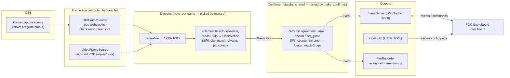

# FGC Stream Event Detector

Watches an OBS **game-capture** source with computer vision and emits stream events over a
WebSocket. It emits one event — **match end, naming the winner** — validated against real footage
for **Street Fighter 6** and **Avatar Legends** (Tekken 8 is scaffolded but deferred; see
[`docs/TODO.md`](docs/TODO.md)).

It is consumed by the [FGC Scoreboard](https://github.com/renatomrcosta/fgc-scoreboard) control
dashboard, which decides what to do with it.

```json
{"type":"match_end","game":"avatar","winner":"p1","confidence":0.94,"ts":"2026-07-21T10:40:00Z"}
```

The detector **announces facts**. It has no concept of a bracket, a set, or a score — policy lives
in the dashboard. **Every game implements the same `Detector` protocol its own way** — that is the
core design idea, not an afterthought:

| Game | Reads | Strategy |
|---|---|---|
| Street Fighter 6 | the games-won-in-set digit beside each name | glyph template match + counter-increment confirmer |
| Avatar Legends | the red/blue round pips flanking the clock emblem | colour fill-ratio + marker confirmer (2 pips → win) |
| Tekken 8 | *(deferred)* | *TBD — its own way* |

Digit counting is SF6's answer to the interface; pip-colour counting is Avatar's. Neither is a
global rule. **To add a game, read [`CLAUDE.md`](CLAUDE.md)** — it is the step-by-step guide.

## Architecture

A frame flows left-to-right. The **detector** is pure and per-game — one frame in, one
`Observation` out, no memory. All temporal reasoning ("a counter went up, so that side won a game")
lives in the stateful **confirmer**. The **server** is the only contact with the outside world.



**Registry + factory.** `get_detector(game)` returns the per-game detector; `make_confirmer(game,
config)` picks the confirmation strategy for that game. Adding a game means adding a detector module
and registering it — the pipeline, server, and CLI are game-agnostic.

**Fails safe.** Every ambiguous reading resolves to "no event." A missed match end is recoverable by
the operator; a false one corrupts the scoreboard. See
[`docs/superpowers/specs/2026-07-22-sf6-counter-detector.md`](docs/superpowers/specs/2026-07-22-sf6-counter-detector.md)
(SF6; note the set-deciding game is not auto-detected — the operator supplies it) and
[`docs/superpowers/specs/2026-07-30-avatar-legends-detector.md`](docs/superpowers/specs/2026-07-30-avatar-legends-detector.md)
(Avatar; see also the calibration report under `docs/superpowers/reports/`).

## Setup

Requires **Python ≥ 3.12** and [**uv**](https://docs.astral.sh/uv/).

```bash
# install uv (macOS)
brew install uv          # or: curl -LsSf https://astral.sh/uv/install.sh | sh

git clone https://github.com/renatomrcosta/fgc-stream-event-detector.git
cd fgc-stream-event-detector

uv sync                  # creates .venv and installs deps + dev group
uv run pytest            # sanity check: full suite should pass
```

`uv sync` installs the `fgc-detect` entry point into the project venv. Run it with `uv run
fgc-detect …` (shown below) or activate the venv (`source .venv/bin/activate`) and call
`fgc-detect …` directly.

### OBS prerequisites (for live `run` only)

1. OBS Studio with the built-in **obs-websocket** server enabled
   (*Tools → WebSocket Server Settings*). Note the port (default `4455`) and password.
2. A **Game Capture** source for the match. The detector reads this source directly — **not** the
   program output — so overlays, cams, and lower-thirds never sit on top of the regions it reads.

## Running

Copy the example config and edit it for your setup:

```bash
cp config.example.toml config.toml
```

Key fields (full annotations in [`config.example.toml`](config.example.toml)):

| Field | Meaning |
|---|---|
| `game` | Active game (`sf6` / `avatar` / `tekken8`) |
| `obs.source_name` | Name of the **Game Capture** source (not a scene, not program output) |
| `obs.host` / `port` / `password` | obs-websocket connection |
| `obs.poll_hz` | Screenshot rate (default `5.0`; above ~10Hz wastes OBS's graphics thread) |
| `server.port` | WebSocket the dashboard connects to (default `6600`) |
| `server.ui_port` | Browser config page (default `6601`) |

### `run` — live against OBS

```bash
uv run fgc-detect run --config config.toml
```

Connects to OBS, serves the WebSocket on `server.port`, and serves the config page at
`http://127.0.0.1:6601`. Runtime settings changed via the UI or a command are persisted back to the
config file. Ctrl-C shuts down cleanly.

### `replay` — run a recorded VOD through the pipeline

The offline path that validates the detector. No OBS needed.

```bash
uv run fgc-detect replay --game sf6 --video ~/repos/sf6.mp4
# → match_end p1 00:01:25 · match_end p2 00:02:18 · match_end p1 00:04:09

uv run fgc-detect replay --game avatar --video ~/repos/avatar.mp4
# → match_end p1 00:02:12 · match_end p2 00:03:49 · match_end p1 00:05:28 · match_end p2 00:08:19
```

Each line is printed as a `match_end` JSON event; the `ts` encodes the position in the video. This
is the fastest way to check a detector end-to-end. `--sample-every N` sets the frame stride
(default 6); `--evidence-dir DIR` dumps the frame and observation behind each fired event for
inspection.

### `capture` — build a labelled sample corpus

```bash
uv run fgc-detect capture --config config.toml --out samples/raw --limit 300
```

Dumps normalized frames from the live OBS source to disk — the raw material for calibrating a new
detector.

### `roi` — visualize a detector's regions of interest

```bash
uv run fgc-detect roi --game sf6 --sample samples/sf6/in_match_p1-0_p2-0_0001.png --out roi_preview.png
```

Draws the detector's ROI boxes over a sample image so you can confirm they land on the right HUD
elements before trusting a reading.

## WebSocket protocol

The dashboard connects to `ws://<server.host>:<server.port>`. On connect it immediately receives a
`status` event and a `config` event; it never has to poll.

**Events (detector → dashboard):**

```json
{"type":"match_end","game":"sf6","winner":"p1","confidence":0.94,"ts":"…Z"}
{"type":"status","game":"sf6","armed":true,"state":"live","obs_connected":true,"ts":"…Z"}
{"type":"config","active_game":"sf6","enabled_games":["avatar","sf6","tekken8"],
 "enabled_events":["match_end"],"available_games":["avatar","sf6"],
 "supported_events":["match_end"],"ts":"…Z"}
```

`status` is pushed on connect and on every state change (`idle` / `live` / `cooldown`, arm/disarm,
game switch, OBS connect/disconnect).

**Commands (dashboard → detector):**

```json
{"cmd":"arm"}                                   // start emitting match-end events
{"cmd":"disarm"}                                // stop emitting (detector keeps observing)
{"cmd":"set_game","game":"sf6"}                 // switch active game
{"cmd":"get_config"}                            // re-request the config event
{"cmd":"set_enabled_games","games":["sf6"]}     // roster offered in the UI
{"cmd":"set_enabled_events","events":["match_end"]}  // which events are delivered
```

Every command is answered with a fresh `status` + `config`. Unrecognized messages get
`{"error":"…"}` and never take the server down.

## Development

```bash
uv run pytest            # full suite — no OBS, GPU, network, or real clock required
```

Tests are hermetic: frame sources, the clock, and OBS are all injected, so the whole suite runs
offline and deterministically. Each detector is validated against a labelled corpus of real frames
(`samples/sf6/`, `samples/avatar/`) built reproducibly by `scripts/build_*_corpus.py`. No test loads
a raw `.mp4` — the committed corpus PNGs are the ground truth.

**Layout:**

```
src/fgc_detector/
  cli.py            run / replay / capture / roi
  server.py         WebSocket event server + command handling
  pipeline.py       offline replay driver
  confirmation.py   make_confirmer factory (strategy per game)
  confirmer.py            marker/pip confirmer (reach-N → win) — SF6 marker + Avatar
  set_score_confirmer.py  SF6 counter-increment confirmer
  events.py         the JSON boundary (only place enums ↔ strings)
  types.py          enums + frozen dataclasses (Game, Side, EventType, DETAIL_* keys, …)
  config.py         TOML load/save
  observability.py  FireRecorder (evidence dumps)
  detectors/        registry.py · roi.py (fill_ratio, color_fill_ratio, match_template)
                    sf6.py · avatar.py · marker.py   ← one module per game
  frames/           obs.py (live), offline.py (VOD), normalize.py
  ui/               http.py + index.html (config page)
```

**Adding a new game?** See [`CLAUDE.md`](CLAUDE.md) — it documents the exact files to touch, the
detector contract, calibration rules, and how to run and test each step.

Design docs live in [`docs/superpowers/`](docs/superpowers/); deferred work in
[`docs/TODO.md`](docs/TODO.md).
